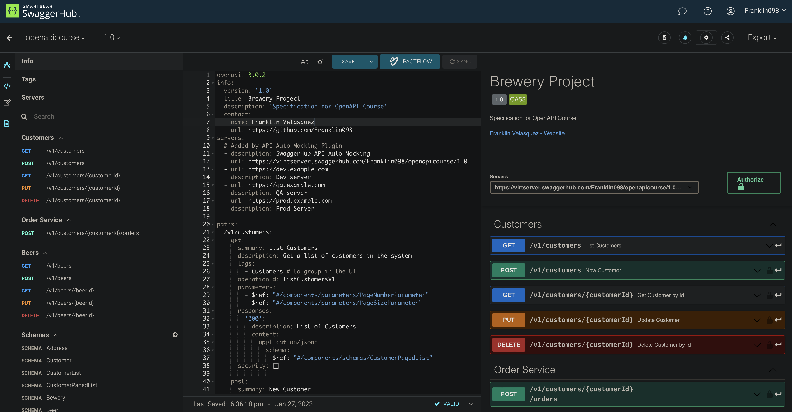
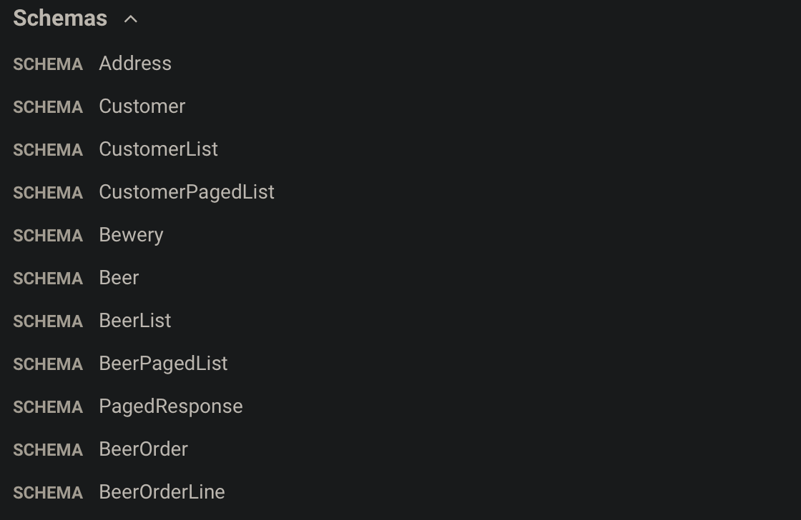
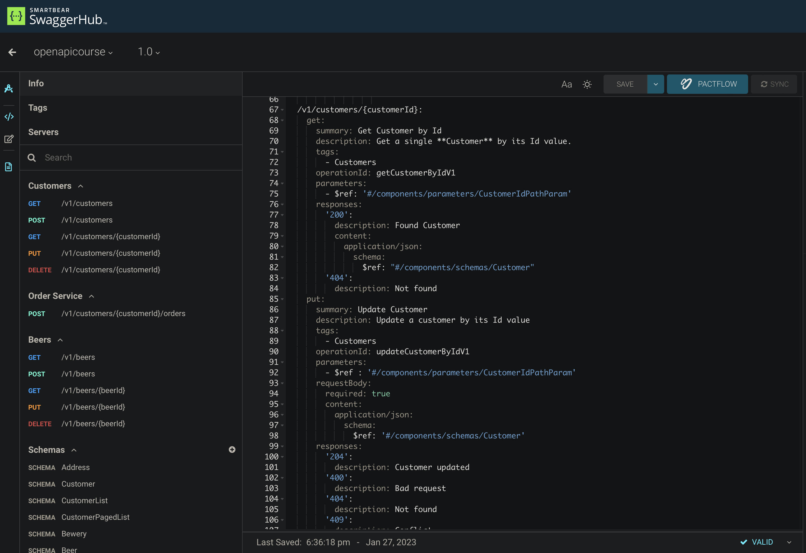

# Brewery - Open API

In this project I learned about the Open API specification for building Restful APIs and how it helps developers to create well design and consistent services with strong schemas.

I used SwaggerHug as the tool to write the API specification for a Brewery.

After completing the specification definition I also played with the code generator tool, which I found very useful for creating skeleton projects.

https://app.swaggerhub.com/apis/Franklin098/openapicourse/1.0

## Schemas

In OpenAPI specification we start by writing schemas. In the case of a Brewery we have some business logic schemas like:

- Customer
- Beer
- Address

From these basic schemas we can write other derived and useful schemas that are going to represent the responses of our services. Some of these schemas are:

- Customer List
- Customer Paged List (for adding pagination)
- Beer List
- Beer Paged List
- Beer Order (master)
- Beer Order Line (detail)

One of the main features of OpenAPI is that we can always use **inheritance** to avoid code duplication.

## Paths

In the paths section we define each of the REST operations of our service.

We can define:

- Operation type
- Path to the service
- Schemas for the request and response of each operation
- Path or url parameters
- Required and optional fields
- Response codes

Go to BrewerySpecification.yaml to see the specification
